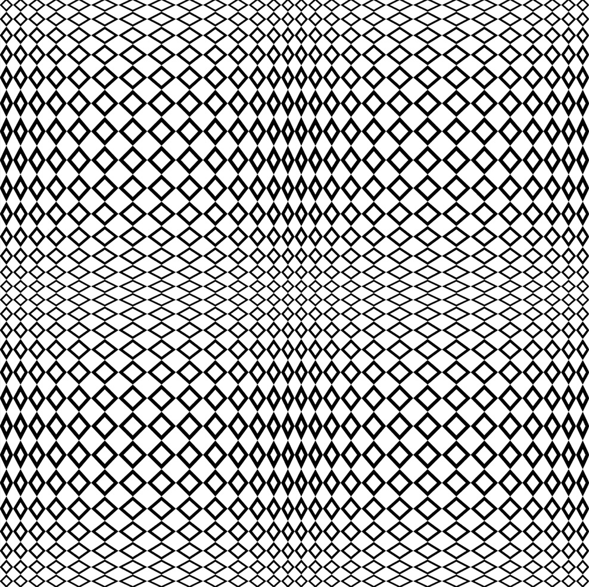

<div ></a></div>

<h1>React Portfolio</h1>

<h2>Table of Content</h2>

- [Project Link](#project-link)
- [Getting Started](#getting-started)
- [Contributors](#contributors)
- [About The project](#about-the-project)

  - [Technologies Used](#technologies-used)

### Project Link

- Please click [here](https://github.com/Amir-Fard2025/react-portfolio) to see the contents of my project in Github
- [here](https://dry-ocean-52104.herokuapp.com/) you can see the react app deployed on Github

### Getting Started

```
git clone
cd react-portfolio
code .
npm i
npm run start


```

### Contributors

- Amir : https://github.com/Amir-Fard2025

### About The Project

<p>Updating my portfolio using REACT</p>
#### Technologies Used

<p>The following technologies are implemented in this project:</p>

- HTML
- CSS
- Tailwindcss
- JavaScript
- REACT
